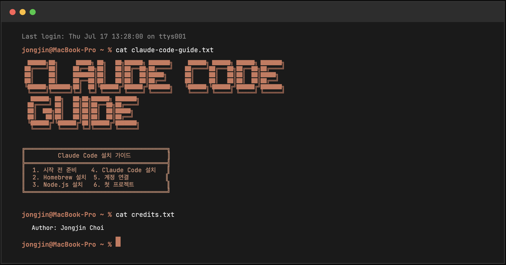

# 🚀 Claude Code Guide (Next.js)

<div align="center">
  
  
  **초보자도 쉽게 따라하는 Claude Code 설치 가이드**
  
  [](https://nextjs.org/)
  [](https://react.dev/)
  [](https://www.typescriptlang.org/)
</div>

## 📖 프로젝트 소개

**Claude Code Guide**는 AI 코딩 어시스턴트인 Claude Code를 처음 사용하는 분들을 위한 인터랙티브 설치 가이드입니다. 터미널을 한 번도 사용해본 적 없는 초보자도 6단계만 따라하면 Claude Code를 설치하고 사용할 수 있습니다.

## ✨ 주요 기능

- 🎯 **단계별 설치 가이드**: 6단계로 구성된 명확한 설치 프로세스
- 💻 **OS별 맞춤 가이드**: Mac/Windows 각각에 최적화된 설명
- 🔄 **실시간 진행률 추적**: 설치 진행 상황을 한눈에 확인
- 🛠 **문제 해결 가이드**: 각 단계별 발생 가능한 문제와 해결책 제공
- 📊 **사용자 분석**: 설치 성공률 및 사용자 행동 분석
- 🌙 **다크모드 지원**: 눈이 편안한 다크 테마 제공

## 🛠 기술 스택

### Frontend
- **Framework**: Next.js 15 (App Router)
- **Language**: TypeScript
- **Styling**: CSS Modules + Tailwind CSS 4
- **State Management**: Zustand + React Context API

### Backend & Services
- **Database**: Supabase (PostgreSQL)
- **Analytics**: Google Analytics 4
- **Email**: Resend
- **Deployment**: Vercel

## 📁 프로젝트 구조

```
claude-code-guide-nextjs/
├── app/
│   ├── components/          # 재사용 가능한 컴포넌트
│   ├── guide/              # 가이드 페이지 및 컴포넌트
│   ├── api/                # API 라우트
│   ├── lib/                # 유틸리티 및 라이브러리
│   ├── types/              # TypeScript 타입 정의
│   └── styles/             # 글로벌 스타일 및 CSS 모듈
├── public/                 # 정적 파일
└── ...
```

## 🌐 라이브 사이트

- **프로덕션**: [https://getclaudecode.com](https://getclaudecode.com)
- **호스팅**: Vercel

## 📊 주요 성과

- 📈 **누적 사용자**: 500+ 명
- 🎯 **가이드 완료율**: 21%
- ⏱ **평균 완료 시간**: 17분
- 💯 **사용자 만족도**: 4.5/5

## 🏆 프로젝트 특징

- **반응형 디자인**: 모든 디바이스에서 최적화된 경험
- **실시간 데이터**: Supabase Realtime으로 즉각적인 피드백
- **SEO 최적화**: 구조화된 데이터와 메타태그 완벽 지원
- **접근성**: WCAG 가이드라인 준수
- **성능 최적화**: Lighthouse 점수 95+

## 👥 만든 사람

**Jongjin Choi**
- Website: [jongjinchoi.com](https://jongjinchoi.com)
- Email: me@jongjinchoi.com
- GitHub: [@jongjinchoi](https://github.com/jongjinchoi)

## 🙏 감사의 말

- [Next.js](https://nextjs.org/) 팀의 훌륭한 프레임워크
- [Vercel](https://vercel.com/) 팀의 멋진 배포 플랫폼
- [Supabase](https://supabase.com/) 팀의 강력한 백엔드 서비스
- Claude Code를 사용하는 모든 개발자들

---

<div align="center">
  Made with ❤️ by <a href="https://github.com/jongjinchoi">Jongjin Choi</a>
</div>